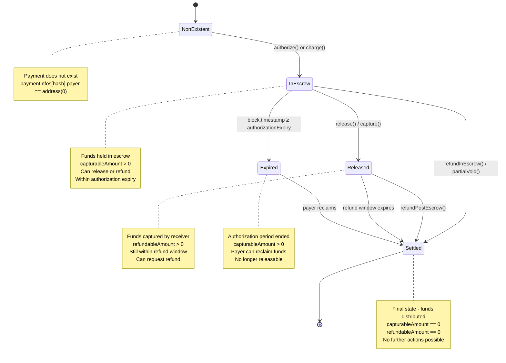
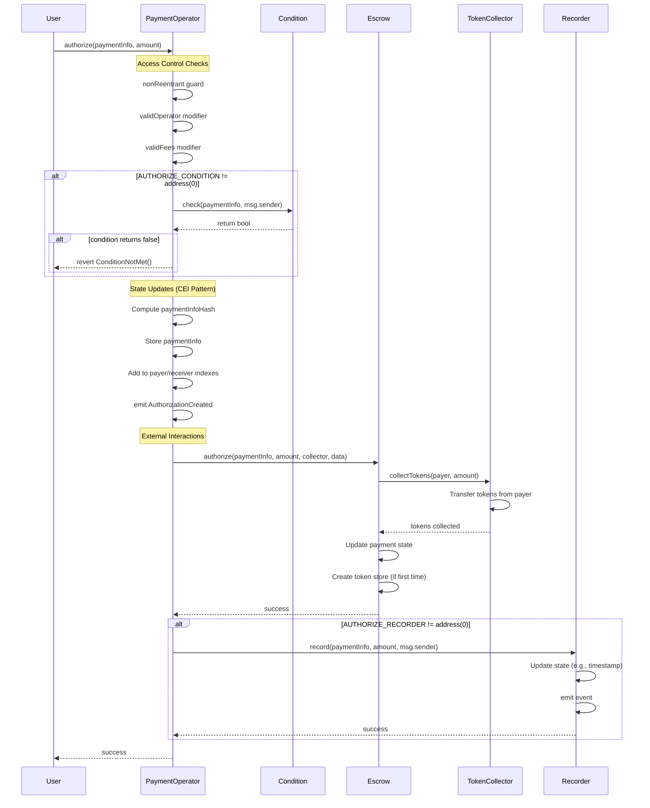
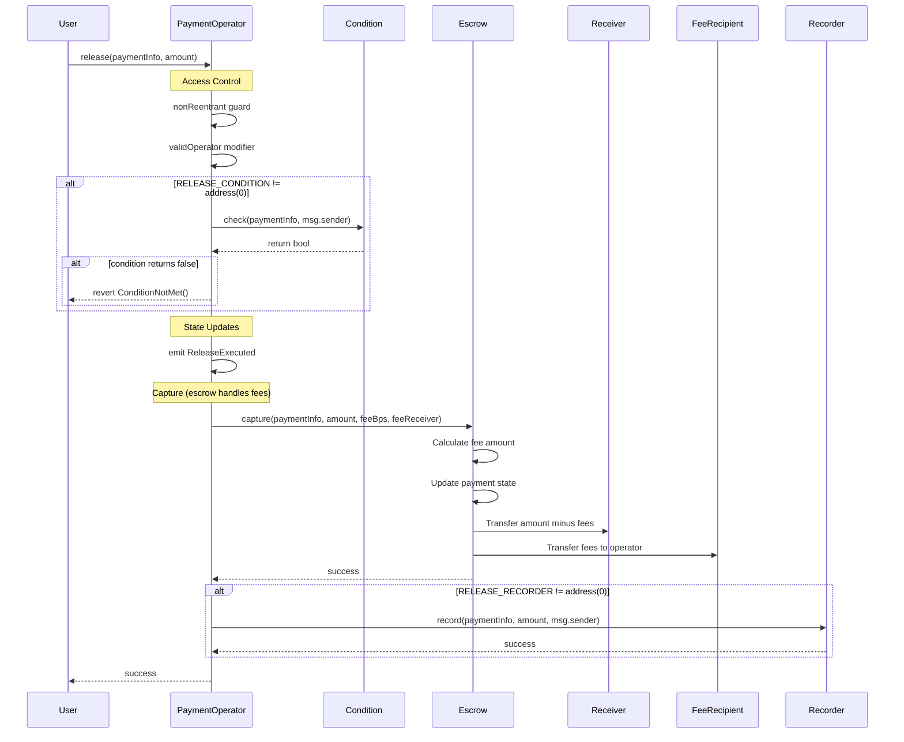
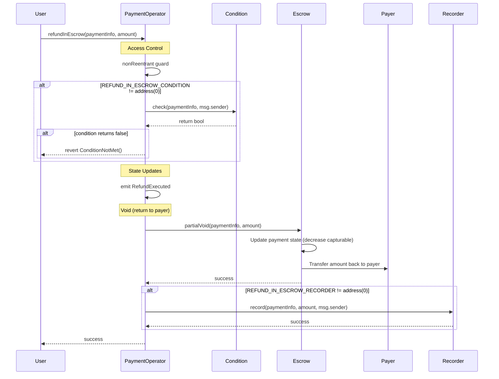
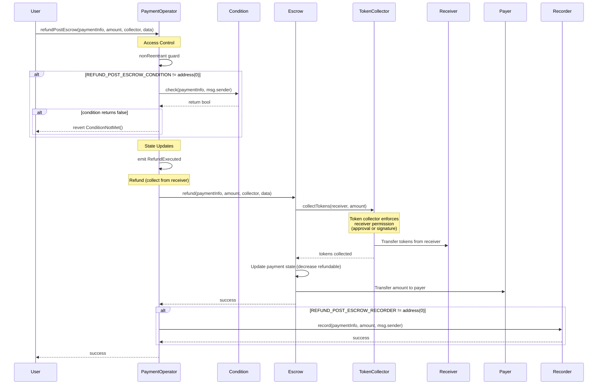
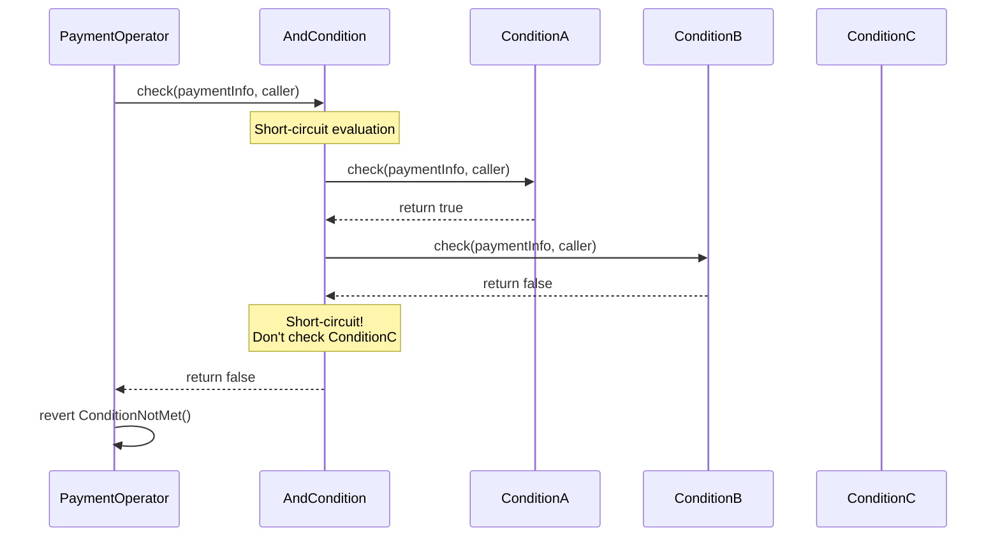
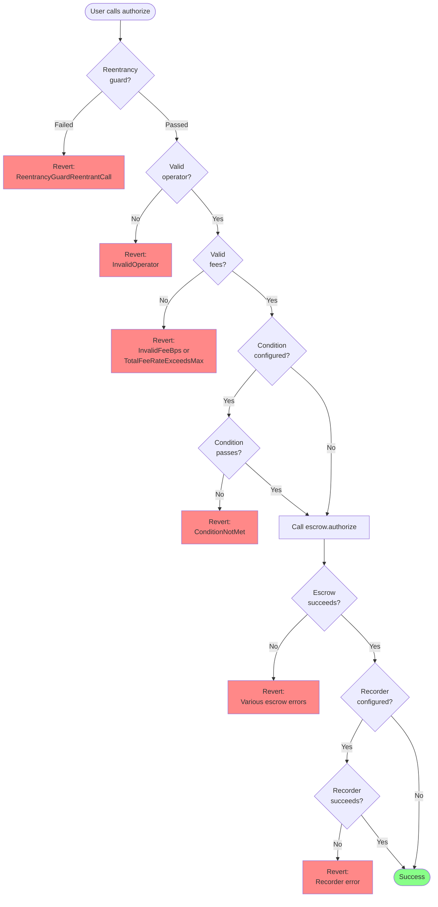
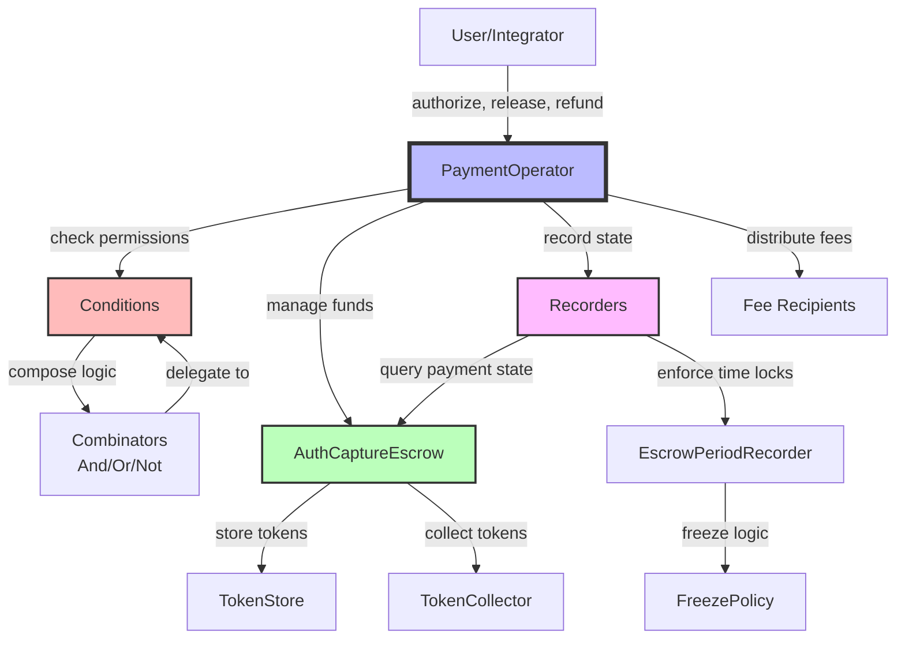

# Contract Diagrams and Visualization

## Inheritance Diagram

An inheritance diagram has been generated showing the contract inheritance structure.

### Prerequisites

Install Graphviz:

```bash
# macOS
brew install graphviz

# Ubuntu/Debian
sudo apt-get install graphviz

# Windows (via Chocolatey)
choco install graphviz
```

### Rendering the Diagram

The inheritance graph is available as `inheritance-graph.dot`. To render it:

```bash
# Generate PNG
dot -Tpng inheritance-graph.dot -o inheritance-graph.png

# Generate SVG (scalable, recommended for documentation)
dot -Tsvg inheritance-graph.dot -o inheritance-graph.svg

# Generate PDF
dot -Tpdf inheritance-graph.dot -o inheritance-graph.pdf
```

### Viewing the Diagram

- **PNG/SVG**: Open with any image viewer
- **PDF**: Open with any PDF viewer
- **Online**: Upload the .dot file to [Graphviz Online](https://dreampuf.github.io/GraphvizOnline/)

### What the Diagram Shows

The inheritance diagram displays:
- Contract inheritance relationships
- Interface implementations
- Library usage
- Contract dependencies

**Key contracts**:
- `PaymentOperator` - Main operator with pluggable conditions
- `AuthCaptureEscrow` - Core escrow contract
- `EscrowPeriodCondition` - Time-based release conditions
- `RefundRequest` - Refund request management
- Condition combinators (And, Or, Not)

### Updating the Diagram

To regenerate after contract changes:

```bash
# Using Solidity Visual Developer (VS Code extension)
# Right-click on main contract → "Solidity: Generate Inheritance Graph"

# Or using Slither
slither . --print inheritance-graph

# Or using Surya
surya inheritance src/commerce-payments/operator/arbitration/PaymentOperator.sol | dot -Tpng -o inheritance.png
```

---

## Call Graph Diagrams

For more detailed analysis, you can generate call graphs:

```bash
# Generate call graph for specific contract
slither . --print call-graph

# This creates multiple .dot files showing function call relationships
```

---

## Contract Summary Diagrams

Generate human-readable contract summaries:

```bash
# Contract summary (functions, modifiers, events)
slither . --print contract-summary

# Human summary (complexity, dependencies)
slither . --print human-summary

# Function summary (visibility, modifiers)
slither . --print function-summary
```

---

## Architecture Diagram

For a high-level architecture overview, see the [ARCHITECTURE.md](ARCHITECTURE.md) file which includes:
- System components
- Data flow diagrams
- Integration patterns
- Trust boundaries

---

## Troubleshooting

### "dot: command not found"

Graphviz is not installed. Follow the installation instructions above.

### "Error opening file for output"

Check file permissions and disk space:

```bash
df -h .  # Check disk space
ls -la inheritance-graph.dot  # Check file exists and is readable
```

### "syntax error in line X"

The .dot file may be corrupted. Regenerate it:

```bash
# Backup old file
mv inheritance-graph.dot inheritance-graph.dot.bak

# Regenerate
slither . --print inheritance-graph
```

### Large diagrams are unreadable

For large codebases, filter to specific contracts:

```bash
# Generate for specific contract only
slither src/commerce-payments/operator/arbitration/PaymentOperator.sol --print inheritance-graph

# Or use SVG format which is scalable
dot -Tsvg inheritance-graph.dot -o inheritance-graph.svg
```

---

## Alternative Visualization Tools

### Solidity Visual Developer (VS Code)

Install extension and use:
- Contract Overview
- Generate UML diagrams
- Interactive inheritance graphs

### Sol2UML

```bash
npm install -g sol2uml

# Generate class diagram
sol2uml class src/commerce-payments/operator/arbitration/PaymentOperator.sol -o PaymentOperator-class.svg

# Generate storage layout
sol2uml storage src/commerce-payments/operator/arbitration/PaymentOperator.sol -o PaymentOperator-storage.svg
```

### Surya

```bash
npm install -g surya

# Inheritance graph
surya inheritance src/**/*.sol | dot -Tpng -o inheritance.png

# Contract graph
surya graph src/**/*.sol | dot -Tpng -o contracts.png

# Describe contracts
surya describe src/**/*.sol
```

---

## Recommended Viewing Order

For understanding the codebase:

1. **Start with**: ARCHITECTURE.md - High-level overview
2. **Then review**: inheritance-graph.svg - Contract relationships
3. **Dive into**: SECURITY.md - Security properties
4. **Explore**: Individual contract documentation

---

## Automation

### Pre-commit Hook

Add diagram generation to git hooks:

```bash
# .git/hooks/pre-commit
#!/bin/bash
if command -v dot &> /dev/null; then
    dot -Tsvg inheritance-graph.dot -o inheritance-graph.svg
    git add inheritance-graph.svg
fi
```

### CI/CD Integration

```yaml
# .github/workflows/diagrams.yml
name: Generate Diagrams

on: [push]

jobs:
  diagrams:
    runs-on: ubuntu-latest
    steps:
      - uses: actions/checkout@v3
      - name: Install Graphviz
        run: sudo apt-get install graphviz
      - name: Generate diagrams
        run: |
          dot -Tsvg inheritance-graph.dot -o inheritance-graph.svg
          dot -Tpng inheritance-graph.dot -o inheritance-graph.png
      - name: Upload artifacts
        uses: actions/upload-artifact@v3
        with:
          name: diagrams
          path: |
            inheritance-graph.svg
            inheritance-graph.png
```

---

## Contributing

When adding new contracts:

1. Regenerate inheritance diagram
2. Update ARCHITECTURE.md if needed
3. Commit updated diagrams with code changes
4. Document any new architectural patterns

---

## Payment Lifecycle State Machine

### State Diagram



### State Transitions

#### 1. NonExistent → InEscrow

**Trigger**: `authorize()` or `charge()`

**Guards**:
- No existing payment with same hash
- Valid operator, fees, and parameters
- Condition check passes (if configured)
- Sufficient token balance/approval

**Effects**:
- Transfers tokens to escrow token store
- Creates payment record
- Sets capturableAmount
- Emits AuthorizationCreated or ChargeExecuted

**Code**: `PaymentOperator.sol:219-250` (authorize), `PaymentOperator.sol:265-299` (charge)

---

#### 2. InEscrow → Released

**Trigger**: `release()` / `capture()`

**Guards**:
- Payment exists and is in escrow (capturableAmount > 0)
- Release condition passes (if configured)
- Not expired (block.timestamp < authorizationExpiry)

**Effects**:
- Transfers funds from escrow to receiver (minus fees)
- Transfers fees to operator
- Decreases capturableAmount
- Increases refundableAmount
- Emits ReleaseExecuted

**Code**: `PaymentOperator.sol:307-335`

---

#### 3. InEscrow → Settled (via refund)

**Trigger**: `refundInEscrow()` / `partialVoid()`

**Guards**:
- Payment is in escrow (capturableAmount > 0)
- Refund condition passes (if configured)
- Caller authorized (typically receiver or arbiter)

**Effects**:
- Returns funds to payer
- Decreases capturableAmount
- If full refund: capturableAmount becomes 0 (Settled)
- Emits RefundExecuted

**Code**: `PaymentOperator.sol:344-369`

---

#### 4. InEscrow → Expired

**Trigger**: Time passes, `block.timestamp ≥ authorizationExpiry`

**Guards**:
- Payment still in escrow (capturableAmount > 0)
- Authorization expiry timestamp reached

**Effects**:
- Payment becomes reclaimable by payer
- No automatic reclaim (requires payer action)
- Release operations will revert

**Code**: `PaymentOperator.sol:517` (getPaymentState check)

---

#### 5. Released → Settled (via refund)

**Trigger**: `refundPostEscrow()`

**Guards**:
- Payment captured (refundableAmount > 0)
- Within refund window (block.timestamp < refundExpiry)
- Refund condition passes (if configured)
- Token collector can source funds

**Effects**:
- Collects tokens from receiver (via token collector)
- Returns tokens to payer
- Decreases refundableAmount
- If full refund: refundableAmount becomes 0 (Settled)
- Emits RefundExecuted

**Code**: `PaymentOperator.sol:382-408`

---

#### 6. Released → Settled (automatic)

**Trigger**: Time passes, `block.timestamp ≥ refundExpiry`

**Guards**:
- Refund window expired

**Effects**:
- No automatic transition (lazy evaluation)
- refundableAmount effectively becomes 0 (refunds not allowed)
- Payment considered settled

---

#### 7. Expired → Settled

**Trigger**: Payer reclaims via `reclaim()` (escrow function)

**Guards**:
- Payment expired (block.timestamp ≥ authorizationExpiry)
- Caller is payer

**Effects**:
- Returns capturable amount to payer
- Sets capturableAmount to 0
- Payment moves to Settled state

**Code**: Handled by escrow contract (not operator)

---

### State Query Implementation

The `getPaymentState()` function determines current state:

```solidity
// PaymentOperator.sol:495-533
function getPaymentState(PaymentInfo calldata paymentInfo)
    external view returns (PaymentState state)
{
    bytes32 hash = ESCROW.getHash(paymentInfo);

    // 1. Check if payment exists
    if (paymentInfos[hash].payer == address(0)) {
        return PaymentState.NonExistent;
    }

    // 2. Get escrow state
    (bool hasCollected, uint120 capturable, uint120 refundable) =
        ESCROW.paymentState(hash);

    if (!hasCollected) return PaymentState.NonExistent;

    // 3. Check expiration
    if (capturable > 0 && block.timestamp >= paymentInfo.authorizationExpiry) {
        return PaymentState.Expired;
    }

    // 4. Determine based on amounts
    if (capturable > 0) return PaymentState.InEscrow;
    if (refundable > 0) return PaymentState.Released;
    return PaymentState.Settled;
}
```

---

## Sequence Diagrams

### Authorize Flow



### Release Flow



### Refund In Escrow Flow



### Refund Post Escrow Flow



### Condition Combinator Flow



---

## Error Flow Diagrams

### Authorization Failure Paths



---

## Component Interaction Diagram



---

**Last Updated**: 2026-01-25
